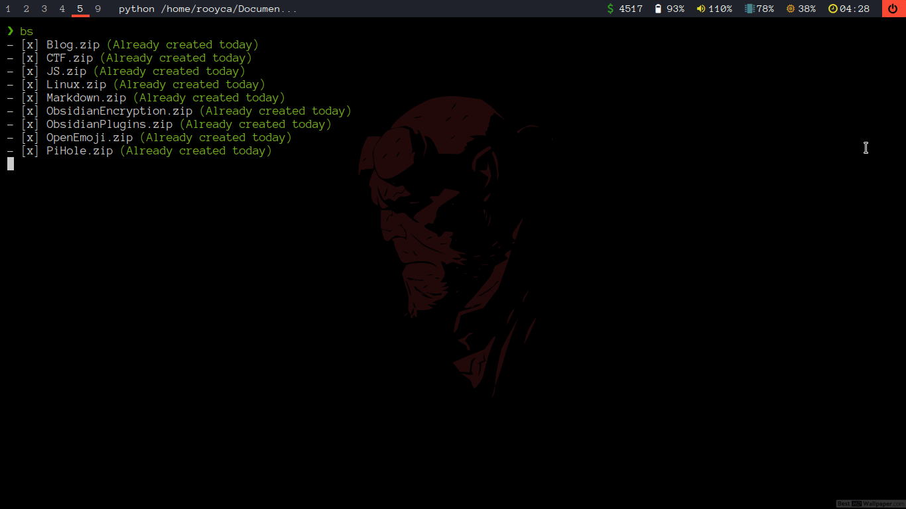

# rooykup - Cross-platform Backup and Sync Tool




## Table of Contents

- [Platform Support](#platform-support)
- [Installation](#installation)
- [Configuration](#configuration)
- [Usage](#usage)
- [Contributing](#contributing)
- [License](#license)

## Platform Support

rooykup is compatible with both Linux and macOS systems. All directories are consistent across platforms:

### Directory Structure (All Platforms)
- Configuration directory: `~/rooykup/`
- Default backup directory: `~/backup`

## Installation

1. Clone this repository
2. Install the required Python dependencies:
```bash
pip install -r requirements.txt
```

## Configuration

### rclone

1. Download rclone from https://rclone.org/downloads/
2. Configure rclone with `rclone config`. Follow the instructions from https://rclone.org/docs/
3. Set a strong configuration password

### rooykup

1. Create a `config.toml` file at `~/rooykup/config.toml`. You can use the provided `config.example.toml` as a template, which includes detailed descriptions of all available options and their default values.

Configuration structure:
```toml
[config]
workingDirectory = "/path/to/working/directory" # Optional: Directory where compressed files and logs will be saved
shutDownAfterBackup = false
forceNewBackup = false  # Global default: Whether to create new backups even if one exists from today
preserveFullPath = true # Global default: Whether to maintain full directory structure in zip files
retentionDays = 7      # Global default: Number of days to keep backup files
remote = ["remote:folder", "remote2:"]
local = "local:"

[exclude]
# Optional: Global directories to exclude from all backups
# These will apply to all backups unless overridden
directories = [".git", "node_modules"] # If none leave it empty

[[pathAndDirName]]
# Each backup configuration can override the global exclude list
path = "/path/to/folder/to/backup"
zipName = "NameOfTheZipFile"  # Optional: If not provided, folder name will be used
forceNewBackup = true         # Optional: Override global forceNewBackup for this directory
retentionDays = 14           # Optional: Override global retentionDays for this directory
preserveFullPath = false      # Optional: Override global preserveFullPath for this directory
exclude = [".env", "tmp"]     # Optional: Override global exclude directories for this backup
```

You can add as many `[[pathAndDirName]]` sections as you want. For each section:
- `path`: (required) Full path to the directory you want to back up
- `zipName`: (optional) Name for the zip file. If not provided, the folder name from the path will be used
- `forceNewBackup`: (optional) Override global setting for force creating new backups
- `retentionDays`: (optional) Override global setting for backup retention period
- `preserveFullPath`: (optional) Override global setting for preserving full path structure

Example:
```toml
# With explicit settings
[[pathAndDirName]]
path = "/home/user/documents"
zipName = "documents"
forceNewBackup = true   # Always create new backups for documents
retentionDays = 14     # Keep documents backups for 14 days
preserveFullPath = true

# Using global defaults
[[pathAndDirName]]
path = "/home/user/pictures"
zipName = "pictures"    # Uses global settings for forceNewBackup, retentionDays, and preserveFullPath

# Automatic subfolder backup
[[autoBackup]]
parentPath = "/home/user/dockers"    # Required: Parent directory to scan
zipNamePrefix = "docker_"            # Optional: Prefix for zip file names
preserveFullPath = true             # Optional: Override global setting
retentionDays = 14                 # Optional: Override global setting
```

### Automatic Subfolder Backup
The `[[autoBackup]]` section allows you to automatically backup all subfolders within a parent directory:
- `parentPath`: (required) Directory to scan for subfolders
- `zipNamePrefix`: (optional) Prefix to add to all zip file names (e.g., "docker_" will create "docker_folder1.zip")
- `preserveFullPath`: (optional) Override global setting for all auto-detected folders
- `retentionDays`: (optional) Override global setting for all auto-detected folders
- `forceNewBackup`: (optional) Override global setting for all auto-detected folders
- `exclude`: (optional) Override global exclude directories for all auto-detected folders

You can have multiple `[[autoBackup]]` sections for different parent directories, each with its own settings and prefix. Each section can override both global settings and exclude directories for its subfolders.

Example: Auto-backup all Docker projects
```toml
[[autoBackup]]
parentPath = "/home/user/dockers"
zipNamePrefix = "docker_"
retentionDays = 14
```
This will automatically backup all subfolders of `/home/user/dockers`, adding "docker_" to the zip name and keeping backups for 14 days.

2. Set the environment variable for rclone configuration:
   - For Bash/Zsh, add to your `.bashrc` or `.zshrc`:
     ```bash
     export RCLONE_CONFIG_PASS="yourRcloneConfigPass"
     ```
   - For macOS, you can also add it to `~/.profile`

## Usage

### Basic Usage
Run the script:
```bash
python rooykup.py
```
Or use the executable from the [release page](https://github.com/Rooyca/rooykup-backup-and-sync/releases)

### Command Line Options
- `-s` or `--shutdown`: Shutdown the system after backup completion
- `-c` or `--force-new-backup`: Force creating a new backup even if one exists from today

### Setting Up Aliases
Add to your `.bashrc`, `.zshrc`, or `~/.profile`:
```bash
alias rooykup="python /path/to/rooykup.py"
```

### Automated Backups
- Linux: Use `cron` or `systemd`
- macOS: Use `launchd` or set up in System Preferences > Battery > Schedule

### Configuration Options
- `retentionDays`: Number of days to keep backup files (default: 7). Older backups are automatically deleted. Set this according to how long you want to retain your backup history.
  * Can be set globally in the `[config]` section
  * Can be overridden per directory in each `[[pathAndDirName]]` section
  * Example: Keep documents for 14 days but pictures for only 7 days

- `forceNewBackup`: Controls how multiple backups on the same day are handled:
  * When false (default): Skip if a backup already exists from today
  * When true: Create a new versioned backup (e.g., `Documents_2024-02-18_v1.zip`, `Documents_2024-02-18_v2.zip`)
  * Can be overridden with `-c` command line option
  * Can be set globally in the `[config]` section
  * Can be overridden per directory in each `[[pathAndDirName]]` section
  * Example: Always create new backups for documents but skip duplicates for pictures

- `shutDownAfterBackup`: Enable automatic shutdown after backup (can be overridden with `-s`)
- `workingDirectory`: Custom backup location (defaults to `~/backup` if not set)
- `preserveFullPath`: When set to true (default), maintains the full directory structure in the zip file. When false, only includes the target directory and its contents.
  * Can be set globally in the `[config]` section
  * Can be overridden per directory in each `[[pathAndDirName]]` section

### Backup File Naming
Backups are now created with a versioned naming scheme:
- Format: `{name}_{date}_v{version}.zip`
- Example: `Documents_2024-02-18_v1.zip`

The version number automatically increments for multiple backups on the same day.

For example, with a backup path of `/home/user/documents/projects`:
- If `preserveFullPath = true`: The zip will contain the full path structure
- If `preserveFullPath = false`: The zip will only contain the "projects" directory structure

### Desktop Integration

#### Linux (Polybar module)
Add to your polybar config:
```ini
[module/bs]
type = custom/script
exec = echo " "
format-prefix = "  "
format-prefix-foreground = #000
format-background = #fb4934
click-left = alacritty --hold -e python /path/to/rooykup.py -s
```

#### macOS
You can create an Automator quick action or use the built-in Calendar app to schedule backups.

## Contributing

Any contributions you make are **greatly appreciated**. <3

## License

Distributed under the MIT License. See `LICENSE` for more information.
